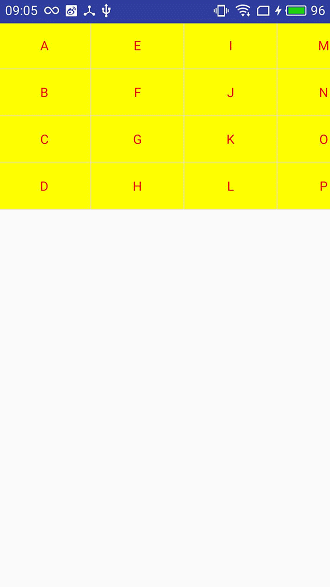

# RecyclerView的实例
### 一、垂直的RecyclerView，类似listview的效果。
#### 1.首先导入库:`compile 'com.android.support:appcompat-v7:25.1.0'`

#### 2.在布局中引入RecyclerView.
    <?xml version="1.0" encoding="utf-8"?>
    <android.support.v7.widget.RecyclerView xmlns:android="http://schemas.android.com/apk/res/android"
	    xmlns:tools="http://schemas.android.com/tools"
	    android:id="@+id/recycler_view"
	    android:layout_width="match_parent"
	    android:layout_height="match_parent"
      >
    </android.support.v7.widget.RecyclerView>
#### 3.初始化RecyclerView。
     recycler_view = (RecyclerView)findViewById(R.id.recycler_view);
    //设置为垂直的样式
    recycler_view.setLayoutManager(new LinearLayoutManager(mContext));
    //使用的是系统默认的分割线
    recycler_view.addItemDecoration(new DividerItemDecoration(mContext, DividerItemDecoration.VERTICAL));
    //设置适配器
    recycler_view.setAdapter(adapter=new BaseAdapter(mContext,mData));
    //设置默认动画
    recycler_view.setItemAnimator(new DefaultItemAnimator());
#### 4.编写适配器BaseAdapter
    public class BaseAdapter extends RecyclerView.Adapter<BaseAdapter.MyViewHolder> {
    
	    private Context mContext;
	    private List<String> mData;
	    
	    //自定义点击事件和长按事件
	    private OnItemClickListener mOnItemClickListener;
	    
	    public void setOnItemClickListener(OnItemClickListener mOnItemClickListener)
	    {
	    this.mOnItemClickListener = mOnItemClickListener;
	    }
	    
	    //构造器
	    public BaseAdapter(Context mContext, List<String> mData) {
	    this.mContext = mContext;
	    this.mData = mData;
	    }
	    //加载布局
	    @Override
	    public MyViewHolder onCreateViewHolder(ViewGroup parent, int viewType) {
	    MyViewHolder holder = new MyViewHolder(LayoutInflater.from(mContext).inflate(R.layout.item_base, parent, false));
	    return holder;
	    }
	    //为布局加载数据
	    @Override
	    public void onBindViewHolder(MyViewHolder holder, int position) {
	    holder.tv_text.setText(mData.get(position));
	    
	    setClickListener(holder,position);
	    }
	    //设置点击事件
	    private void setClickListener(final MyViewHolder holder, int position) {
	    if(mOnItemClickListener!=null){
	    holder.itemView.setOnClickListener(new View.OnClickListener() {
	    @Override
	    public void onClick(View view) {
	    int pos = holder.getLayoutPosition();
	    mOnItemClickListener.onItemClick(holder.itemView, pos);
	    }
	    });
	    }
	    
	    holder.itemView.setOnLongClickListener(new View.OnLongClickListener()
	    {
	    @Override
	    public boolean onLongClick(View v)
	    {
	    int pos = holder.getLayoutPosition();
	    mOnItemClickListener.onItemLongClick(holder.itemView, pos);
	    return true;//返回true可以屏蔽点击监听的响应
	    }
	    });
	    }
	    
	    //总共多少个项
	    @Override
	    public int getItemCount() {
	    return mData.size();
	    }
	    //初始化布局信息
	    class MyViewHolder extends RecyclerView.ViewHolder{
	    TextView tv_text;
	    public MyViewHolder(View itemView) {
	    super(itemView);
	    tv_text = (TextView) itemView.findViewById(R.id.tv_text);
	    }
	    }
	    
	    //添加
	    public void addData(int position) {
	    mData.add(position, "Insert One");
	    notifyItemInserted(position);
	    }
	    //删除
	    public void removeData(int position) {
	    mData.remove(position);
	    notifyItemRemoved(position);
	    }
    }
#### 5.添加点击监听，长按监听。写一个接口类。
    public interface OnItemClickListener {
	    void onItemClick(View view, int position);
	    void onItemLongClick(View view , int position);
    }
#### 6.BaseAdapter中已经使用了这个接口，在activity调用。
    adapter.setOnItemClickListener(new OnItemClickListener() {
    @Override
    public void onItemClick(View view, int position) {
	    view.startAnimation(animation);
	    Toast.makeText(mContext, position + " click",
   		Toast.LENGTH_SHORT).show();
    }
    
    @Override
    public void onItemLongClick(View view, int position) {
	    view.startAnimation(animation);
	    Toast.makeText(mContext, position + " long click",
	    Toast.LENGTH_SHORT).show();
    }
    });
#### 7.效果图

### 二、网格的RecyclerView。
#### 1.只需要修改两处代码
     //设置为水平网格样式
    recycler_view.setLayoutManager(new StaggeredGridLayoutManager(4,StaggeredGridLayoutManager.HORIZONTAL));//如果需要垂直，改为垂直即可
    ////使用的是自定义的网格分割线
    recycler_view.addItemDecoration(new DividerGridItemDecoration(mContext));
#### 2.有一个DividerGridItemDecoration这个类需要自定义，网格分割线，代码如下：
    public class DividerGridItemDecoration extends RecyclerView.ItemDecoration{
	    private static final int[] ATTRS = new int[] { android.R.attr.listDivider };
	    private Drawable mDivider;
	    
	    public DividerGridItemDecoration(Context context)
	    {
		    final TypedArray a = context.obtainStyledAttributes(ATTRS);
		    mDivider = a.getDrawable(0);
		    a.recycle();
	    }
	    
	    @Override
	    public void onDraw(Canvas c, RecyclerView parent, RecyclerView.State state)
	    {
	    
		    drawHorizontal(c, parent);
		    drawVertical(c, parent);
	    
	    }
	    
	    private int getSpanCount(RecyclerView parent)
	    {
		    // 列数
		    int spanCount = -1;
		    RecyclerView.LayoutManager layoutManager = parent.getLayoutManager();
		    if (layoutManager instanceof GridLayoutManager)
		    {
		    
			    spanCount = ((GridLayoutManager) layoutManager).getSpanCount();
			} else if (layoutManager instanceof StaggeredGridLayoutManager)
		    {
			    spanCount = ((StaggeredGridLayoutManager) layoutManager)
			    .getSpanCount();
		    }
		    return spanCount;
		    }
		    
		    public void drawHorizontal(Canvas c, RecyclerView parent)
		    {
			    int childCount = parent.getChildCount();
			    for (int i = 0; i < childCount; i++)
			    {
				    final View child = parent.getChildAt(i);
				    final RecyclerView.LayoutParams params = (RecyclerView.LayoutParams) child
				    .getLayoutParams();
				    final int left = child.getLeft() - params.leftMargin;
				    final int right = child.getRight() + params.rightMargin
				    + mDivider.getIntrinsicWidth();
				    final int top = child.getBottom() + params.bottomMargin;
				    final int bottom = top + mDivider.getIntrinsicHeight();
				    mDivider.setBounds(left, top, right, bottom);
				    mDivider.draw(c);
		    	}
	    }
	    
	    public void drawVertical(Canvas c, RecyclerView parent)
	    {
		    final int childCount = parent.getChildCount();
		    for (int i = 0; i < childCount; i++)
		    {
			    final View child = parent.getChildAt(i);
			    
			    final RecyclerView.LayoutParams params = (RecyclerView.LayoutParams) child
			    .getLayoutParams();
			    final int top = child.getTop() - params.topMargin;
			    final int bottom = child.getBottom() + params.bottomMargin;
			    final int left = child.getRight() + params.rightMargin;
			    final int right = left + mDivider.getIntrinsicWidth();
			    
			    mDivider.setBounds(left, top, right, bottom);
			    mDivider.draw(c);
		    }
	    }
	    
	    private boolean isLastColum(RecyclerView parent, int pos, int spanCount,
	    int childCount)
	    {
		    RecyclerView.LayoutManager layoutManager = parent.getLayoutManager();
		    if (layoutManager instanceof GridLayoutManager)
		    {
		    	if ((pos + 1) % spanCount == 0)// 如果是最后一列，则不需要绘制右边
		    {
		    return true;
		    }
		    } else if (layoutManager instanceof StaggeredGridLayoutManager)
		    {
		    int orientation = ((StaggeredGridLayoutManager) layoutManager)
		    .getOrientation();
		    if (orientation == StaggeredGridLayoutManager.VERTICAL)
		    {
		    	if ((pos + 1) % spanCount == 0)// 如果是最后一列，则不需要绘制右边
		    {
		    return true;
		    }
		    } else
		    {
		    childCount = childCount - childCount % spanCount;
		    if (pos >= childCount)// 如果是最后一列，则不需要绘制右边
		    return true;
		    }
		    }
	   		return false;
	    }
	    
	    private boolean isLastRaw(RecyclerView parent, int pos, int spanCount,
	      int childCount)
	    {
	    RecyclerView.LayoutManager layoutManager = parent.getLayoutManager();
	    if (layoutManager instanceof GridLayoutManager)
	    {
	    childCount = childCount - childCount % spanCount;
	    if (pos >= childCount)// 如果是最后一行，则不需要绘制底部
	    return true;
	    } else if (layoutManager instanceof StaggeredGridLayoutManager)
	    {
	    int orientation = ((StaggeredGridLayoutManager) layoutManager)
	    .getOrientation();
	    // StaggeredGridLayoutManager 且纵向滚动
	    if (orientation == StaggeredGridLayoutManager.VERTICAL)
	    {
	    childCount = childCount - childCount % spanCount;
	    // 如果是最后一行，则不需要绘制底部
	    if (pos >= childCount)
	    return true;
	    } else
	    // StaggeredGridLayoutManager 且横向滚动
	    {
	    // 如果是最后一行，则不需要绘制底部
	    if ((pos + 1) % spanCount == 0)
	    {
	    return true;
	    }
	    }
	    }
	    return false;
	    }
	    
	    @Override
	    public void getItemOffsets(Rect outRect, int itemPosition,
	       RecyclerView parent)
	    {
	    int spanCount = getSpanCount(parent);
	    int childCount = parent.getAdapter().getItemCount();
	    if (isLastRaw(parent, itemPosition, spanCount, childCount))// 如果是最后一行，则不需要绘制底部
	    {
	    outRect.set(0, 0, mDivider.getIntrinsicWidth(), 0);
	    } else if (isLastColum(parent, itemPosition, spanCount, childCount))// 如果是最后一列，则不需要绘制右边
	    {
	    outRect.set(0, 0, 0, mDivider.getIntrinsicHeight());
	    } else
	    {
	    outRect.set(0, 0, mDivider.getIntrinsicWidth(),
	    mDivider.getIntrinsicHeight());
	    }
	    }
    }
#### 3.效果图

### 三、用RecyclerView做的四级联动。这部分代码比较多，也比较复杂，请看demo吧
#### 1.效果图

### 四、带刷新的RecyclerView,这个需要引入一个新的库，XRecyclerView，用github搜索一下，用第一个就行。
#### 1.引入XRecyclerView的库，`compile 'com.jcodecraeer:xrecyclerview:1.3.2'`，下载地址https://github.com/jianghejie/XRecyclerView
#### 2.在布局中使用XRecyclerView.
    <?xml version="1.0" encoding="utf-8"?>
    <com.jcodecraeer.xrecyclerview.XRecyclerView xmlns:android="http://schemas.android.com/apk/res/android"
    xmlns:tools="http://schemas.android.com/tools"
    android:id="@+id/recycler_view"
    android:layout_width="match_parent"
    android:layout_height="wrap_content"
    >
    
    </com.jcodecraeer.xrecyclerview.XRecyclerView>
#### 3.其他的都跟一类似，刷新时，使用
     recycler_view.setLoadingListener(new XRecyclerView.LoadingListener() {
    @Override
    public void onRefresh() {
    refresh();
    }
    @Override
    public void onLoadMore() {
    loadMore();
    }
    });
#### 4.注意刷新完成，无论上拉还是下拉，完成之后都要执行`recycler_view.refreshComplete();`，如果下拉加载更多，已经没有更多了，那么，需要执行`recycler_view.loadMoreComplete();`
#### 5.效果图：

### 五、用RecyclerView做瀑布流，
#### 1.只需要更改两处即可
     //设置为垂直3列
    recycler_view.setLayoutManager(new StaggeredGridLayoutManager(3,StaggeredGridLayoutManager.VERTICAL));
    ////item间隔16
    recycler_view.addItemDecoration(new SpacesItemDecoration(16));
#### 2.其中SpacesItemDecoration这个类的是为了添加间距，代码如下。
    public class SpacesItemDecoration extends RecyclerView.ItemDecoration {
    
    private int space;
    
    public SpacesItemDecoration(int space) {
    this.space=space;
    }
    
    @Override
    public void getItemOffsets(Rect outRect, View view, RecyclerView parent, RecyclerView.State state) {
    outRect.left=space;
    outRect.right=space;
    outRect.bottom=space;
    if(parent.getChildAdapterPosition(view)==0){
    outRect.top=space;
    }
    }
    }
#### 3.这里还添加了，增加还删除单项操作，点击增加第一项，长按删除第二项。因为添加过默认动画，所以会有效果。
     adapter.setOnItemClickListener(new OnItemClickListener() {
    @Override
    public void onItemClick(View view, int position) {
    view.startAnimation(animation);
    Toast.makeText(mContext, position + " 添加A",
    Toast.LENGTH_SHORT).show();
    adapter.addData(0);
    }
    
    @Override
    public void onItemLongClick(View view, int position) {
    view.startAnimation(animation);
    Toast.makeText(mContext, position + " 删除B",
    Toast.LENGTH_SHORT).show();
    adapter.removeData(2);
    }
    });
#### 4.效果图

### 六、多个item的RecyclerView。
#### 1.新建一个DifferentItemAdapter,代码如下
        public class DifferentItemAdapter extends RecyclerView.Adapter {
    private Context mContext;
    private List<String> mData;
    
    private static final int CASE1=1;
    private static final int CASE2=2;
    
    public DifferentItemAdapter(Context mContext, List<String> mData) {
    this.mContext = mContext;
    this.mData = mData;
    }
    //自定义点击事件和长按事件
    private OnItemClickListener mOnItemClickListener;
    
    public void setOnItemClickListener(OnItemClickListener mOnItemClickListener)
    {
    this.mOnItemClickListener = mOnItemClickListener;
    }
    @Override
    public RecyclerView.ViewHolder onCreateViewHolder(ViewGroup parent, int viewType) {
    switch (viewType){
    case CASE1:
       return new MyViewHolder(LayoutInflater.from(mContext).inflate(R.layout.item_base, parent, false));
    case CASE2:
    return new DifferentHolder(LayoutInflater.from(mContext).inflate(R.layout.item_different,parent,false));
    }
    return null;
    }
    
    @Override
    public void onBindViewHolder(RecyclerView.ViewHolder holder, int position) {
    if(position%2==0){
    DifferentHolder holder1= (DifferentHolder) holder;
    holder1.tv_text.setText(mData.get(position));
    }else{
    MyViewHolder holder2= (MyViewHolder) holder;
    holder2.tv_text.setText(mData.get(position));
    }
    
    setClickListener(holder,position);
    }
    
    @Override
    public int getItemCount() {
    return mData.size();
    }
    //这个非常重要，根据这个选择不同的布局
    @Override
    public int getItemViewType(int position) {
    if(position%2==0){
    return CASE2;
    }else{
    return CASE1;
    }
    }
    
    //初始化布局信息
    class MyViewHolder extends RecyclerView.ViewHolder{
    TextView tv_text;
    public MyViewHolder(View itemView) {
    super(itemView);
    tv_text = (TextView) itemView.findViewById(R.id.tv_text);
    }
    }
    
    class DifferentHolder extends RecyclerView.ViewHolder{
    TextView tv_text;
    public DifferentHolder(View itemView) {
    super(itemView);
    tv_text = (TextView) itemView.findViewById(R.id.tv_text);
    }
    }
    
    
    //设置点击事件
    private void setClickListener(final RecyclerView.ViewHolder holder, int position) {
    if(mOnItemClickListener!=null){
    holder.itemView.setOnClickListener(new View.OnClickListener() {
    @Override
    public void onClick(View view) {
    int pos = holder.getLayoutPosition();
    mOnItemClickListener.onItemClick(holder.itemView, pos);
    }
    });
    }
    
    holder.itemView.setOnLongClickListener(new View.OnLongClickListener()
    {
    @Override
    public boolean onLongClick(View v)
    {
    int pos = holder.getLayoutPosition();
    mOnItemClickListener.onItemLongClick(holder.itemView, pos);
    return true;//返回true可以屏蔽点击监听的响应
    }
    });
    }
    }`
####里面只是更改了继承的方式，继承RecyclerView.Adapter，不需要泛型了，同时多了一个public int getItemViewType(int position) 这个函数，根据不同的类型加载不同的布局。只需要改Adapter其他的不用变。
#### 2.效果图

